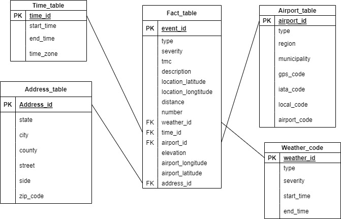

# Traffic Events Dataset
### Data Engineering Capstone Project

#### Project Summary
In this project, we implement an ETL process for a traffic events dataset via creating a star schema. Our schema enables data scientists to use the dataset stored in 
the data warehouse for purposes such as traffic analysis and prediction, impact prediction, accident prediction, routing engine optimization, travel time estimation.   
The project follows the follow steps:
* Step 1: Scope the Project and Gather Data
* Step 2: Explore and Assess the Data
* Step 3: Define the Data Model
* Step 4: Run ETL to Model the Data

**Please download the dataset used in this project from https://smoosavi.org/datasets/lstw.**

### Step 1: Scope the Project and Gather Data

This project builds an optimized star schema via 
leveraging Apache Spark. Our data consists of three 
different csv files. 
The first and second files are countrywide traffic 
and weather events, which can be found here https://smoosavi.org/datasets/lstw.

The third file is Airport codes, which is available in this repository. 
Based on these three files, we build our data warehouse 
via creating a star schema. Since our data is a big data,
 we use Spark to manage it. Our designed schema
  helps potential users to leverage the dataset for 
 purposes such as traffic analysis and prediction, 
impact prediction, accident prediction, routing engine optimization, 
travel time estimation, and many other research applications.

#### Data Description

**Traffic Events**: this is a countrywide traffic events dataset 
collected from August 2016 to the end of Dec 2020, and covers 49 
states of the United States.

**Weather Events**: this is a countrywide weather events dataset 
collected from August 2016 to the end of Dec 2020, and covers 49 
states of the United States.

**Airport codes**: this worldwide dataset includes airport codes
 and corresponding cities.
 
 ### Step 2: Explore and Assess the Data
#### Explore the Data 
Based on the data description, which can be found in https://smoosavi.org/datasets/lstw, the traffic and weather datasets have NaN valuse in some columns. However, this issue is not a big problem becasue we assume that in this project we create a star schema, then our data scinetist will handle missing values. The good news is that event id in both weather and traffic datasets, which would be the primary keys of our tables in the star schema, do not include any null values. 

#### Cleaning Steps
However, we have some problems:

1. We should modify the name of columns StartTime(UTC), EndTime(UTC), Distance(mi) in tables traffic and weather because they do not represent proper names. 

2. Column Coordinates in airport table contains a list of values, we should break this column to two different columns. Moreover, since traffic and weather datasets related only to US, we modify column isoregion to contains only the name of states. 

3. Table traffic has six million rows, since we need to do several table joins to create our star schema and we work on a single machine, a portion of dataset is used (roughly two million rows). We only consider data gathered after 2019-01-01.  

4. Since traffic dataset is a big dataset, we change its format to Parquet format that increases our speed to manage the data. 
### Step 3: Define the Data Model
#### 3.1 Conceptual Data Model

To establish our star schema, based on the given three datasets, we create one fact table and four dimension tables as follows: 

The fact table stores measures of the dataset along with foreign keys, and the dimension tables contain other information about weather, airport, time, and address of traffic events. 

#### 3.2 Mapping Out Data Pipelines
To implement our star schema we should follow the steps of ETL:

**1**. We should extract data from the given three data sources (csv files), which has been done in the previous section. Indeed, we have three staging tables. 

**2**. Data needs some transformations, we should apply them. This step also has been done in the previous section.

**3**. By using the staging tables, fact and dimension tables are built. This step is implemented in the next section. 
### Step 4: Run Pipelines to Model the Data 
To run the ETL pipeline, please run main.py file. 
